# Gallery

Full-resolution renders of a published-film abstract timeline model.
Each render below links to the **SVG vector master** (crisp at any zoom) and the
native-resolution **PNG**. Click an image or a link to open it full-size.

*(Sensitive/unpublished screenplays are deliberately excluded from the gallery.)*

### Back to the Future Part II
*worlds: **1***

#### 2D
[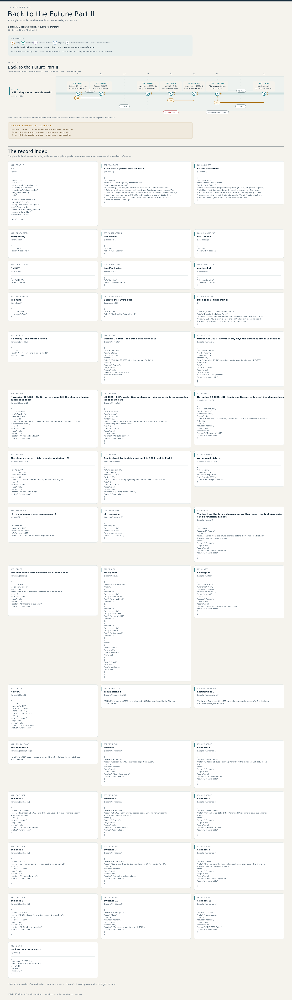](bttf2-2d.svg)
Open: [`bttf2-2d.svg`](bttf2-2d.svg) · [`bttf2-2d.png`](bttf2-2d.png)

#### 2.5D
[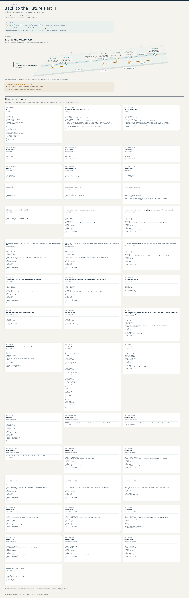](bttf2-2.5d.svg)
Open: [`bttf2-2.5d.svg`](bttf2-2.5d.svg) · [`bttf2-2.5d.png`](bttf2-2.5d.png)

### Dark
*worlds: **5***

#### 2D
[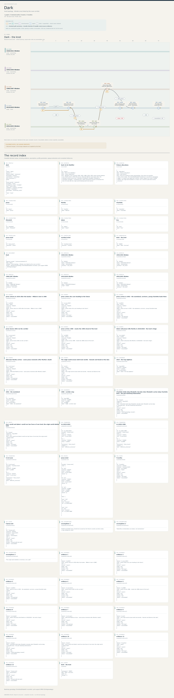](dark-2d.svg)
Open: [`dark-2d.svg`](dark-2d.svg) · [`dark-2d.png`](dark-2d.png)

#### 2.5D
[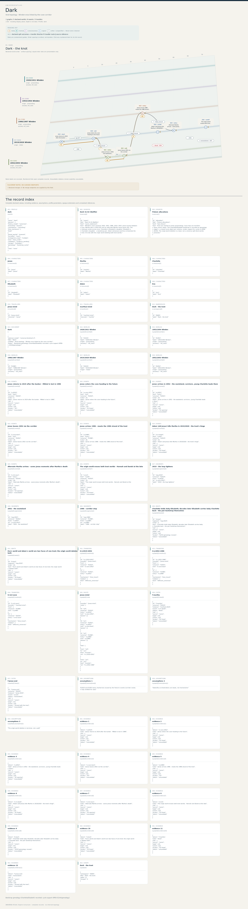](dark-2.5d.svg)
Open: [`dark-2.5d.svg`](dark-2.5d.svg) · [`dark-2.5d.png`](dark-2.5d.png)

### EDGE OF TOMORROW — The Verdun loop
*worlds: **1***

#### 2D
[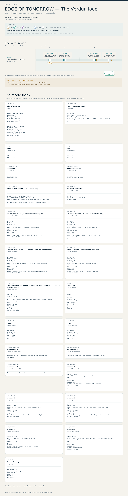](edge-of-tomorrow-2d.svg)
Open: [`edge-of-tomorrow-2d.svg`](edge-of-tomorrow-2d.svg) · [`edge-of-tomorrow-2d.png`](edge-of-tomorrow-2d.png)

#### 2.5D
[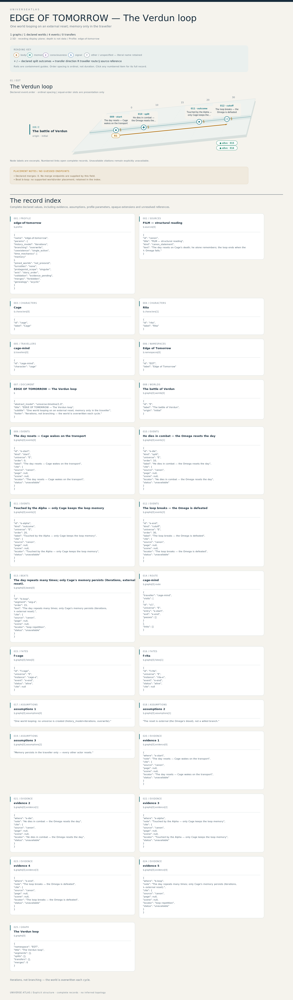](edge-of-tomorrow-2.5d.svg)
Open: [`edge-of-tomorrow-2.5d.svg`](edge-of-tomorrow-2.5d.svg) · [`edge-of-tomorrow-2.5d.png`](edge-of-tomorrow-2.5d.png)

### EVERYTHING EVERYWHERE ALL AT ONCE — The verse-jump net
*worlds: **4***

#### 2D
[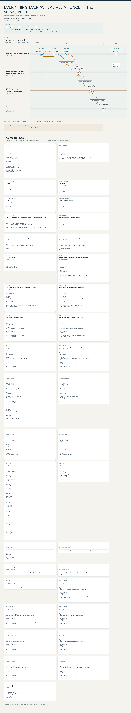](eeaao-2d.svg)
Open: [`eeaao-2d.svg`](eeaao-2d.svg) · [`eeaao-2d.png`](eeaao-2d.png)

#### 2.5D
[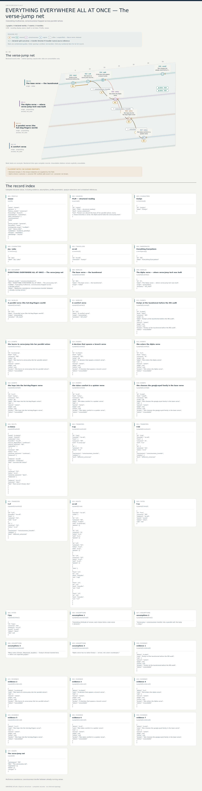](eeaao-2.5d.svg)
Open: [`eeaao-2.5d.svg`](eeaao-2.5d.svg) · [`eeaao-2.5d.png`](eeaao-2.5d.png)

### Groundhog Day
*worlds: **1***

#### 2D
[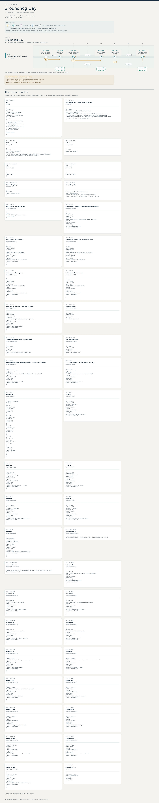](groundhog-2d.svg)
Open: [`groundhog-2d.svg`](groundhog-2d.svg) · [`groundhog-2d.png`](groundhog-2d.png)

#### 2.5D
[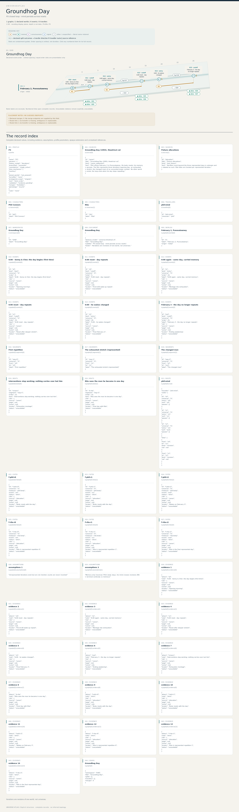](groundhog-2.5d.svg)
Open: [`groundhog-2.5d.svg`](groundhog-2.5d.svg) · [`groundhog-2.5d.png`](groundhog-2.5d.png)

### INTERSTELLAR — The tesseract signal
*worlds: **1***

#### 2D
[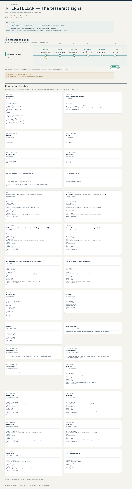](interstellar-2d.svg)
Open: [`interstellar-2d.svg`](interstellar-2d.svg) · [`interstellar-2d.png`](interstellar-2d.png)

#### 2.5D
[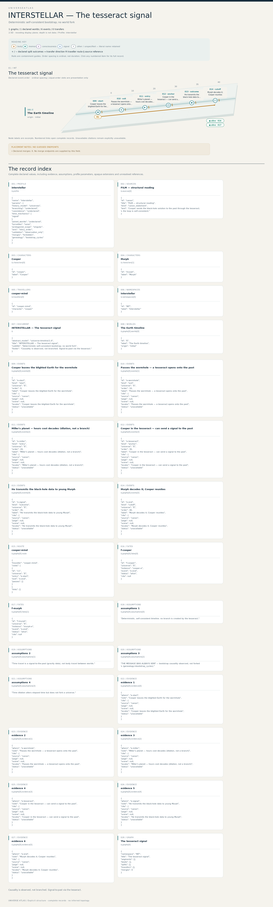](interstellar-2.5d.svg)
Open: [`interstellar-2.5d.svg`](interstellar-2.5d.svg) · [`interstellar-2.5d.png`](interstellar-2.5d.png)

### PREDESTINATION — The temporal agency loop
*worlds: **1***

#### 2D
[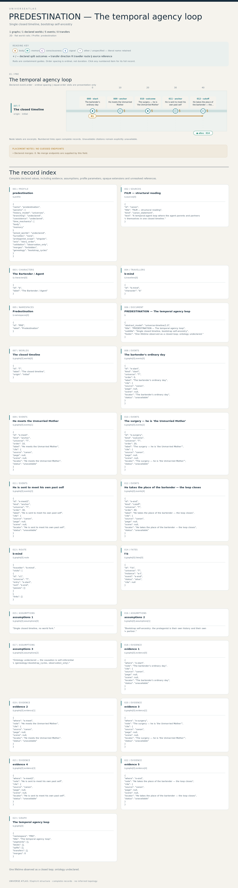](predestination-2d.svg)
Open: [`predestination-2d.svg`](predestination-2d.svg) · [`predestination-2d.png`](predestination-2d.png)

#### 2.5D
[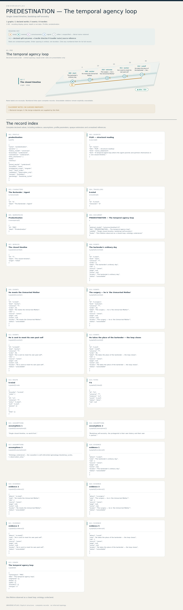](predestination-2.5d.svg)
Open: [`predestination-2.5d.svg`](predestination-2.5d.svg) · [`predestination-2.5d.png`](predestination-2.5d.png)

### Steins;Gate
*worlds: **1***

#### 2D
[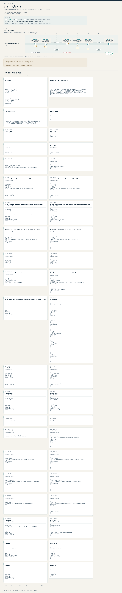](steinsgate-2d.svg)
Open: [`steinsgate-2d.svg`](steinsgate-2d.svg) · [`steinsgate-2d.png`](steinsgate-2d.png)

#### 2.5D
[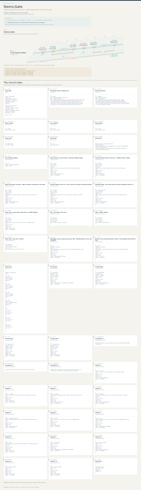](steinsgate-2.5d.svg)
Open: [`steinsgate-2.5d.svg`](steinsgate-2.5d.svg) · [`steinsgate-2.5d.png`](steinsgate-2.5d.png)

### Tenet
*worlds: **3***

#### 2D
[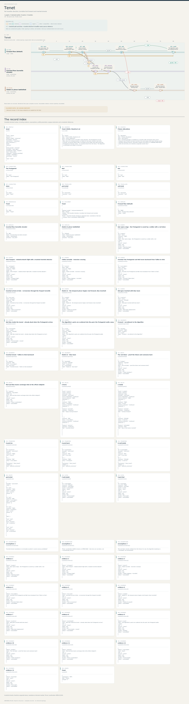](tenet-2d.svg)
Open: [`tenet-2d.svg`](tenet-2d.svg) · [`tenet-2d.png`](tenet-2d.png)

#### 2.5D
[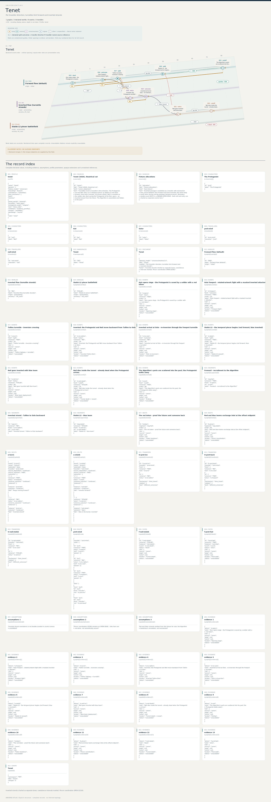](tenet-2.5d.svg)
Open: [`tenet-2.5d.svg`](tenet-2.5d.svg) · [`tenet-2.5d.png`](tenet-2.5d.png)

